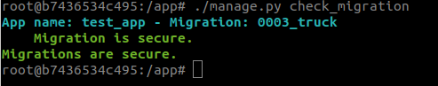
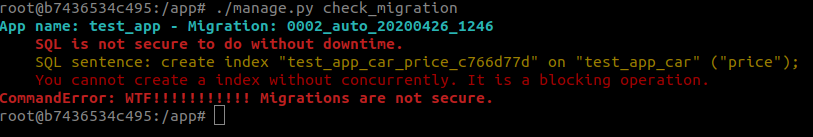

# django-check-migration-wtf

## Description

**django-check-migration-wtf** is an extension for Django to check migrations and notify you if their are secure to do 
on environments with zero downtime. 

In some situations Django Migration system generate migrations to need do a downtime because they are blocking operation 
or you write custom migration than can block you database.

Actually this extension only works for backends of PostgresSQL and Postgis.

**Advise**: this extension notify you for common blocking operations on database. Anyway you should review your migrations and understand their.

## Configuration

It is really simple

### Installation

Install the package with the typical tool (pip):

`pip install django-check-migration-wtf`

### Add to your project

Add app on your settings:

```python
INSTALLED_APPS = [
    'django_check_migration_wtf',
    ...,
]
```

### Add some optional vars 

Add some optional setup on your settings:

* `CHECK_MIGRATION_WTF_PSQL_VERSION` It is to know your PostgresSQL Version by default it is 9 
* The next following vars are for use github integration:
    * `CHECK_MIGRATION_WTF_GITHUB_TOKEN` Token to can use API of github, It only need permission of reading of repo.
    * `CHECK_MIGRATION_WTF_REPO_NAME` Name of repository on Github
    
## Usage

It is really easy to use. It is execute by a typical django command like `makemigrations` or `migrate`...
It has two mode of usage.

### Local

First execute your `makemigrations` and you can do your custome modifications. Then **before** execute command `migrate` 
execute the following command:

`python manage.py check_migration`

It will search all migrations that are not apply to the system (like `showmigrations`) and it will analyze if they are secure to do.

You can have two possibilities:
 
*   When the migration or migrations are **secure**, you get the following response:

    

* When the migration or migrations are **not secure**, you get the following response:

    

### Github

This is reality an option of command to execute it on your continues integration. 
It will search you migrations comparing the base branch and your current branch and the analyze it

`python manage.py check_migration --github <head_ref> <base_ref>`

## Limitations

* This extension not analyze code inside of `RunPython`
* Github option to work correctly suppose your migrations are inside of directory **migrations** 
